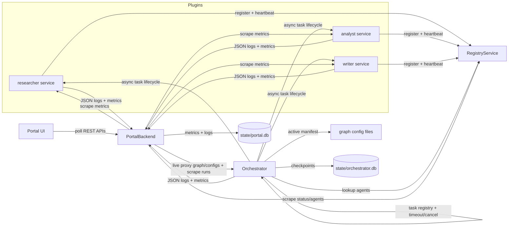

# Day 5 Agent Orchestration — Technical Design and Platform Topology

> Purpose: define the software stack, components, interfaces, schemas, and data flows for the framework and management portal.

## 1. Software Stack

### Backend and Runtime

| Concern | Choice | Notes |
|---------|--------|-------|
| Language | Python 3.12 | Matches repository `.venv`. |
| Orchestration | LangGraph 1.x | Compiles and executes graph manifests. |
| Checkpointing | `langgraph-checkpoint-sqlite` | SQLite-backed LangGraph checkpointer. |
| Agent logic | LangChain 1.x + `langchain-openai` | Reuses OpenAI-compatible provider config. |
| Services | FastAPI + Uvicorn | Registry, agent services, orchestrator, portal backend. |
| Wire schemas | Pydantic v2 | Single source of truth for HTTP payloads and manifests. |
| HTTP client | `httpx` | Async task calls and metric scraping. |
| Manifests | PyYAML | `agent.yaml`, `orchestration.yaml`, and `orchestration.llm.yaml`. |
| Logging | Python standard `logging` | Custom JSON formatter + async forwarding. |
| Metrics | In-process counters/histograms | Exposed as JSON from `/metrics`. |
| Storage | SQLite | Checkpoints, runs, metrics snapshots, and logs. |

### Portal Frontend

| Concern | Choice |
|---------|--------|
| Framework | React 18 + TypeScript |
| Build tool | Vite |
| Graph visualization | `@xyflow/react` |
| Charts | `recharts` |
| Live update | HTTP polling every 2–5 seconds |
| Dev server | Vite with `/api` proxy |

## 2. Topology



## 3. Component Responsibilities

| Component | Responsibility |
|-----------|----------------|
| `framework/schemas.py` | Pydantic models for agent cards, manifests, tasks, runs, logs, metrics. |
| `framework/registry.py` | FastAPI registry; stores agent cards in memory with heartbeat TTL. |
| `framework/registry_client.py` | Async client for register, heartbeat, list, and lookup. |
| `framework/agent_service.py` | Generic FastAPI service hosting one plugin handler. |
| `framework/agent_client.py` | Async HTTP client for remote agent task lifecycle. |
| `framework/graph_compiler.py` | Validates and compiles `orchestration.yaml` into LangGraph. |
| `framework/orchestrator.py` | Run API, graph execution, checkpointing, run task registry, timeout/cancel, graph switching. |
| `framework/checkpoint.py` | Creates and configures SQLite checkpointer. |
| `framework/logging.py` | JSON stdlib logging setup and async log forwarder. |
| `framework/metrics.py` | Counters/histograms and JSON `/metrics` rendering. |
| `portal_backend/` | Aggregates status, topology, runs, metrics, and logs into SQLite. |
| `portal-ui/` | React/Vite management portal. |
| `plugins/` | Example deployable agent plugins. |
| `config/orchestration.yaml` | Fixed pipeline graph definition. |
| `config/orchestration.llm.yaml` | LLM-supervised graph definition. |

## 4. Proposed Folder Structure

```text
day5-agent-orchestration/
├── requirement.md
├── agent.md
├── iteration.md
├── README.md
├── requirements.txt
├── .env.example
├── main.py
├── config/
│   ├── orchestration.yaml
│   └── orchestration.llm.yaml
├── framework/
│   ├── schemas.py
│   ├── registry.py
│   ├── registry_client.py
│   ├── agent_service.py
│   ├── agent_client.py
│   ├── graph_compiler.py
│   ├── orchestrator.py
│   ├── checkpoint.py
│   ├── logging.py
│   ├── metrics.py
│   └── runner.py
├── plugins/
│   ├── researcher/
│   ├── analyst/
│   └── writer/
├── portal_backend/
│   ├── app.py
│   ├── store.py
│   ├── aggregator.py
│   └── api.py
├── portal-ui/
│   ├── src/
│   └── package.json
├── state/
│   ├── orchestrator.db
│   └── portal.db
└── tests/
```

## 5. Runtime Flows

### 5.1 Agent Startup and Discovery

1. CLI loads an `agent.yaml`.
2. CLI launches the plugin as a Uvicorn process.
3. `AgentService` publishes its `AgentCard` to the registry.
4. `AgentService` heartbeats every few seconds.
5. Registry marks agents without recent heartbeat as `stale`, then `offline`.
6. Orchestrator and portal resolve live agents through the registry.

### 5.2 Orchestration Run

1. Portal or CLI submits a run.
2. Orchestrator creates an `asyncio.Task`, records `status=running` and `graph_config`, and returns the run id immediately.
3. Orchestrator reads the active graph manifest.
4. Graph compiler validates the manifest and compiles a LangGraph graph.
5. Orchestrator resolves each `agent` node through the registry.
6. `agent` node sends `TaskRequest` to the agent service.
7. Agent service returns `202` with a task id.
8. Orchestrator polls `GET /tasks/{task_id}` until completion or timeout.
9. Node result is written to LangGraph state.
10. LangGraph checkpoints state to `state/orchestrator.db`.
11. On completion, cancellation, or timeout, the run summary is finalized with outputs/error and exposed to the portal.

### 5.3 Metrics Flow

1. Each service maintains in-process counters/histograms.
2. Each service exposes `GET /metrics` as JSON.
3. Portal backend periodically scrapes healthy services.
4. Portal backend stores snapshots in `state/portal.db`.
5. Portal UI polls `/api/agents/{name}/metrics`.

### 5.4 Log Flow

1. Every service uses standard `logging`.
2. A JSON formatter emits structured records.
3. Each service writes to stdout and a local JSONL file.
4. An async forwarder POSTs batches to `/logs/ingest`.
5. Portal backend stores records in `state/portal.db`.
6. Portal UI filters logs through `/api/agents/{name}/logs`.

## 6. Key Interfaces

### 6.1 Registry API

| Method | Path | Description |
|--------|------|-------------|
| POST | `/register` | Register or update an `AgentCard`. |
| POST | `/heartbeat/{name}` | Refresh an agent's TTL. |
| GET | `/agents` | List agents with health status. |
| GET | `/agents/{name}` | Get one agent with health status. |

### 6.2 Agent Service API

| Method | Path | Description |
|--------|------|-------------|
| GET | `/health` | Service health. |
| GET | `/agent-card` | Return the plugin's `AgentCard`. |
| GET | `/metrics` | Return JSON metrics. |
| POST | `/tasks` | Submit a `TaskRequest`. |
| GET | `/tasks/{task_id}` | Poll `TaskStatus`. |

### 6.3 Orchestrator API

| Method | Path | Description |
|--------|------|-------------|
| POST | `/runs` | Start a run. |
| GET | `/runs` | List runs, including `graph_config`. |
| GET | `/runs/{run_id}` | Return run state, outputs, and graph config. |
| POST | `/runs/{run_id}/cancel` | Cancel a running job. |
| GET | `/graph-configs` | List available graph configs. |
| POST | `/graph-configs/apply` | Switch active graph config; rejects with 409 while jobs are running. |
| GET | `/metrics` | Return orchestrator metrics. |
| GET | `/graph` | Return compiled graph topology. |

### 6.4 Portal Backend API

| Method | Path | Description |
|--------|------|-------------|
| GET | `/api/agents` | Aggregated agent status. |
| GET | `/api/graph` | Live current orchestration topology. |
| GET | `/api/graph-configs` | Live available graph configs. |
| POST | `/api/graph-configs/apply` | Proxy graph config switch. |
| GET | `/api/runs` | Recent runs; supports `graph_config` filter. |
| GET | `/api/runs/{run_id}` | Selected run detail/path. |
| POST | `/api/runs/{run_id}/cancel` | Proxy run cancellation. |
| GET | `/api/agents/{name}/metrics` | Traffic time series. |
| GET | `/api/agents/{name}/logs` | Filtered structured logs. |
| POST | `/logs/ingest` | Ingest log records. |
| POST | `/metrics/ingest` | Ingest metric snapshots. |
| GET | `/health` | Portal backend health. |

## 7. Schemas

### 7.1 `agent.yaml`

```yaml
apiVersion: agent-framework/v1
kind: Agent
name: researcher
version: 1.0.0
description: Retrieves passages from the internal knowledge base.
entrypoint: service:build_agent
port: 8011
capabilities:
  streaming: false
inputs:
  query: string
  context: optional<string>
outputs:
  artifact: string
```

### 7.2 `orchestration.yaml`

```yaml
version: 1
name: research_report
entry: researcher
nodes:
  researcher:
    type: agent
    agent: researcher
    input:
      query: "{query}"
    output_key: findings
  analyst:
    type: agent
    agent: analyst
    input:
      query: "{query}"
      context: "{findings}"
    output_key: analysis
  writer:
    type: agent
    agent: writer
    input:
      query: "{query}"
      context: "{analysis}"
    output_key: report
edges:
  - from: researcher
    to: analyst
  - from: analyst
    to: writer
  - from: writer
    to: END
```

Supported node types:

- `agent`: calls a remote agent and stores the result under `output_key`.
- `supervisor`: chooses the next node and uses conditional edges.

### 7.3 Core Types

| Type | Key Fields |
|------|------------|
| `AgentCard` | `name`, `description`, `version`, `endpoint`, `capabilities`, `inputs`, `outputs`. |
| `TaskState` | `submitted`, `working`, `completed`, `failed`. |
| `TaskRequest` | `task_id`, `run_id`, `node_id`, `query`, `context`, `inputs`. |
| `TaskStatus` | `task_id`, `state`, `artifact`, `error`, timestamps. |
| `GraphManifest` | `name`, `entry`, `nodes`, `edges`. |
| `NodeSpec` | `id`, `type`, `agent`, `input`, `output_key`, routing config. |
| `EdgeSpec` | `from`, `to`, optional `when`. |
| `RunSummary` | `run_id`, `graph_config`, `status`, `query`, `outputs`, `error`, events, timestamps. |
| `RunState` | `run_id`, `query`, outputs dictionary, routing state, error, events. |

### 7.4 JSON Log Record

```json
{
  "timestamp": "2026-08-22T12:00:00.000Z",
  "level": "INFO",
  "service": "researcher",
  "agent": "researcher",
  "run_id": "optional",
  "node_id": "optional",
  "event": "task.completed",
  "message": "Task completed",
  "extra": {}
}
```

### 7.5 Metrics

Per agent:

- `requests.total`
- `requests.active`
- `requests.completed`
- `requests.failed`
- `latency_ms` histogram, including p50, p95, and max
- `errors.total`

Orchestrator:

- `runs.total`
- `runs.active`
- `runs.completed`
- `runs.failed`
- per-node latency

## 8. Error Handling and Recovery

- Registry entries expire after a configurable TTL.
- Agent HTTP client retries transient 5xx and network errors with backoff.
- Task polling has a hard timeout; timeout produces a failed run with a clear error.
- LangGraph state is checkpointed after each super-step.
- A failed run records `state=failed` and `error` for portal display.
- Stale/offline agents are excluded from graph resolution and shown in the portal.
- Runs are wrapped in `asyncio.wait_for` with a configurable timeout, default 120 seconds.
- Cancelled runs are marked `failed` with `"cancelled"`.
- Portal reconciliation marks stale `running` rows as failed.
- Graph switching is refused with `409` while any run is active.

## 9. Security and Assumptions

- v1 is localhost-only.
- No authentication or authorization.
- Registry membership is in-memory.
- Agent task state is in-process; an individual agent restart loses in-flight tasks.
- LangGraph checkpoints, portal metrics, and portal logs are persisted in SQLite.
- No external message queue, metric database, or log search system.

## 10. Hot-Plug Sequence

1. Add `plugins/<new-agent>/agent.yaml` and service handler.
2. Launch the new agent service.
3. Agent registers and starts heartbeating.
4. Add a node and edge referencing the agent to the appropriate graph config.
5. Select the graph config in the portal and click Apply, or call `POST /graph-configs/apply`.
6. On the next run, orchestrator re-reads the active manifest, resolves the new agent from the registry, and executes it.
7. Portal backend discovers the new agent during the next scrape and shows it in the UI.

No orchestrator, registry, or portal restart is required.
